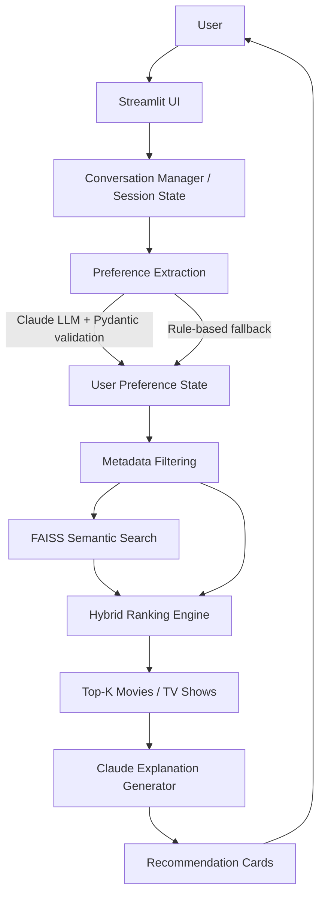

# CineMatch AI — Architecture

## Pipeline



## Modules

### `config/settings.py`
Environment-driven settings (loaded from `.env`). Provides `get_settings()`
which caches a single `Settings` instance and guarantees required directories.

### `src/models/`
Pydantic data models:
- `preferences.py` — `UserPreferences` (all fields optional) plus `merge()`
  for conversation aggregation.
- `movie.py` — `Movie` with ranking/explanation output fields.

### `src/services/`
- `llm_service.py` — Claude wrapper: `extract_preferences`,
  `generate_recommendation_explanation`, `generate_followup_response`.
  JSON recovery + rule-based fallbacks. Never hardcodes keys.
- `tmdb_client.py` — TMDB REST wrapper with timeout, retries, TTL caching and
  rate-limit handling. Degrades to `None` when the key is missing.

### `src/chatbot/`
- `conversation.py` — `ConversationManager` owns `conversation_history`,
  `user_preferences`, `recommended_movies` in Streamlit session state.
- `preference_extractor.py` — regex/heuristic extraction used as the offline
  fallback (genres, negations, runtime, years, similar-titles, people, mood…).
- `prompts.py` — shared prompt templates.

### `src/recommender/`
- `embeddings.py` — SentenceTransformer wrapper (`all-MiniLM-L6-v2`), batched
  generation, persistent caching to `artifacts/embeddings.npy`.
- `vector_store.py` — FAISS flat index persistence
  (`artifacts/faiss.index`, `artifacts/metadata.pkl`) + `search()`.
- `ranking.py` — component scores, min-max normalization, weighted final
  score, `compute_preference_match`, explainable `build_match_reasons`.
- `recommender.py` — hybrid engine combining semantic + metadata +
  preference matching and delegating to ranking.

### `scripts/`
- `prepare_data.py` — raw -> processed pipeline (cleaning, normalization,
  combined searchable text).
- `build_index.py` — embedding matrix + FAISS index + metadata.
- `evaluate.py` — Precision@K / Recall@K / Hit@K / NDCG@K.
- `generate_sample_data.py` — bundled curated dataset for zero-setup demos.

## Hybrid ranking

```
final_score = 0.50 * semantic_similarity
            + 0.20 * preference_match
            + 0.15 * rating_score
            + 0.10 * popularity_score
            + 0.05 * freshness_score
```

Each component is min-max normalized before combination (per candidate pool);
weights are configurable via `config/settings.py` or per call.

- `semantic_similarity` — FAISS cosine similarity of combined metadata text.
- `preference_match` — fraction of applicable preference constraints satisfied.
- `rating_score` — linear ramp from the user's minimum rating to 10.0.
- `popularity_score` — normalized TMDB-style popularity.
- `freshness_score` — recency relative to the newest title in the pool.

Hard filters (genre exclusions, content type, min rating, year range, runtime
bounds, languages, actors, directors, family-friendly) are applied *before*
scoring.

## Data flow

1. **Prepare**: `prepare_data.py` reads `data/raw/movies_metadata.csv` (or the
   bundled sample) and writes `data/processed/processed_movies.csv` with a
   `combined_text` column = `title + overview + genres + keywords + cast +
   director`.
2. **Embed**: `build_index.py` embeds `combined_text` in batches and persists
   `artifacts/embeddings.npy`.
3. **Index**: a FAISS `IndexFlatIP` over the embeddings plus a pickled metadata
   list aligned by row index.
4. **Query**: the app embeds the user query / similar-title text, searches
   FAISS, merges preference-matched rows, filters hard constraints, and ranks.

## Degradation / fallbacks

| Dependency missing    | Behaviour                                             |
|-----------------------|-------------------------------------------------------|
| `ANTHROPIC_API_KEY`   | Rule-based preference extraction + templated replies  |
| `TMDB_API_KEY`        | Local dataset only; placeholder posters               |
| Embedding model       | Embedding generation errors surfaced by build script  |
| FAISS index absent    | Clear message in UI: run prepare + build scripts      |
| Poster fetch fails    | Placeholder image                                     |
